#### Loan Hoang - COMMUNICATIONS LAB - Fall 2020
# Assignment 1: 30MFF Website

## Concept: 

This is my first ever attempt to make a website from scratch using HTML, CSS, and a little bit of Javascript. The goal of the website is to introduce the video that my group had filmed.  

Our video has a funny, simple, and improvising style so I aimed to make a website that also have those characteristic. I want my website's visiters to have an entertaining experience with both the website and the video. Included with the funny music in the video, I chose bright and funky color for the inteface. For the font, I chose the clean and simple one. Moreover, I took advantages of boomerang clips in my website. Boomerang clips are also represent for funkiness as it usually marketed via Instagram. 

## Difficulties: 

In the process of making the website, of course I encountered various difficulties. Up till now, there are still enhancing ideas that I have not finished yet. However, I am very satisfied with my result as I could not believe that I managed to created a website. This first assignment is a good start off for me to familiarized with designing on a digital screen size canvas. I believe that so far with this experience, I be able to do even better in the upcoming projects. 

## Some Footages of the Process: 
### Wireframes:

### Raw:

### Finished:

# Assignment 2 : Comix Strip
## Website Link: https://ishmalkhalid.github.io/FinalMomentsComic/
## Concept: 
In this assignment, our team (Ishmal, Loan, Matthew, and Michael) is telling a story through our interactive comic website. 

We have our comic named as "Last Moments" narrating events in one day before our main protagonist dies in a car accident. We want to express the unexpectedness of deaths through our story. 

## Responsiblity:
My responsibility for this project is leanning more on the artistic and building story side than on the technical web development. 

I am responsible for the sript writing, framing the panels, color/images choosing, and media managing. More specifically, I am also in charged of finding the stock images, ambience sounds, and making the intro video. 

## Difficulties: 
In this project, the main difficulty that I encounter is conflicting in ideas due to different perspective about arts. We had disagreement on the font choosing, the size/ length of the video, the plot of the story, et cetera. Fortunately, we managed to compromise things to reach a futher goals of finishing our project. 

The other difficulty that our group struggle with is the respect of deadline. Yet, at the end, I am happy that my team succeeded in reaching our goals. 

## Improvements:
As a team member, I am satisfied with my team's result. I am glad that despite all the challenges that we encounter, we managed to have an interesting comic for the class. 

However, if I have more room for improvements, I would make the color palette more consistent between the book and the website. I would also figure out how to have the video has sound while being autoplayed and looped. I would also want to have more responsive panels when mouse being hovered over them. 

## Some Footages of the Process: 
The final result is definitely different from what we initially planned (as you can compared the wireframes with the finished version of the website).

### Wireframes:
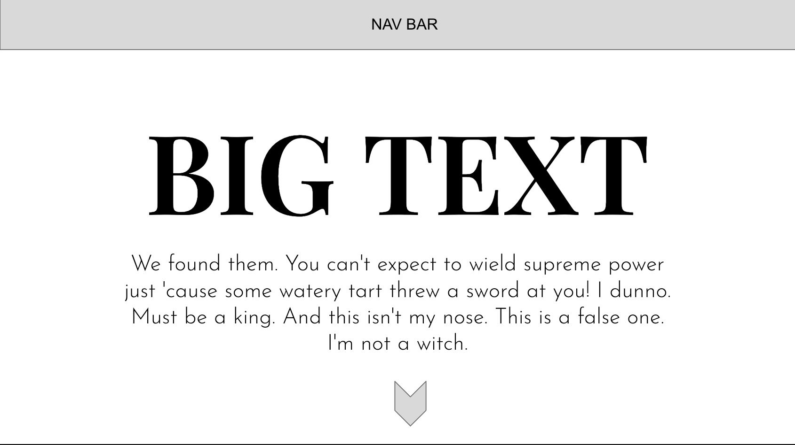
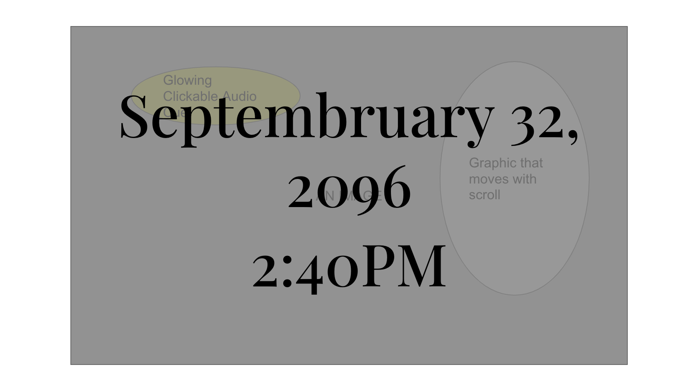
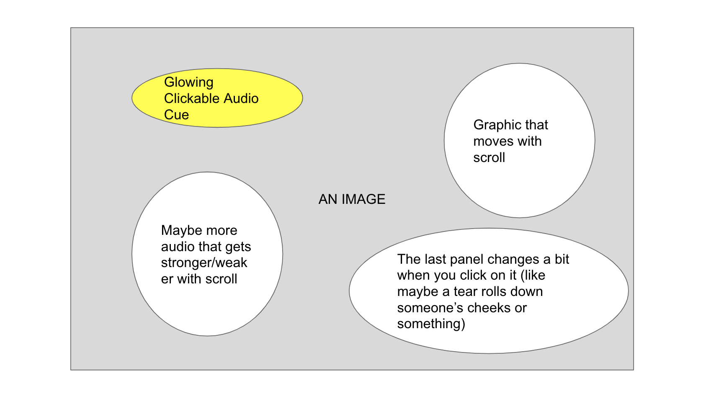
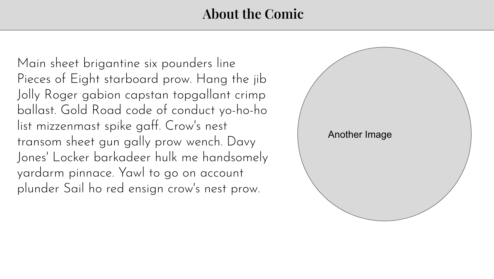

### Finished:
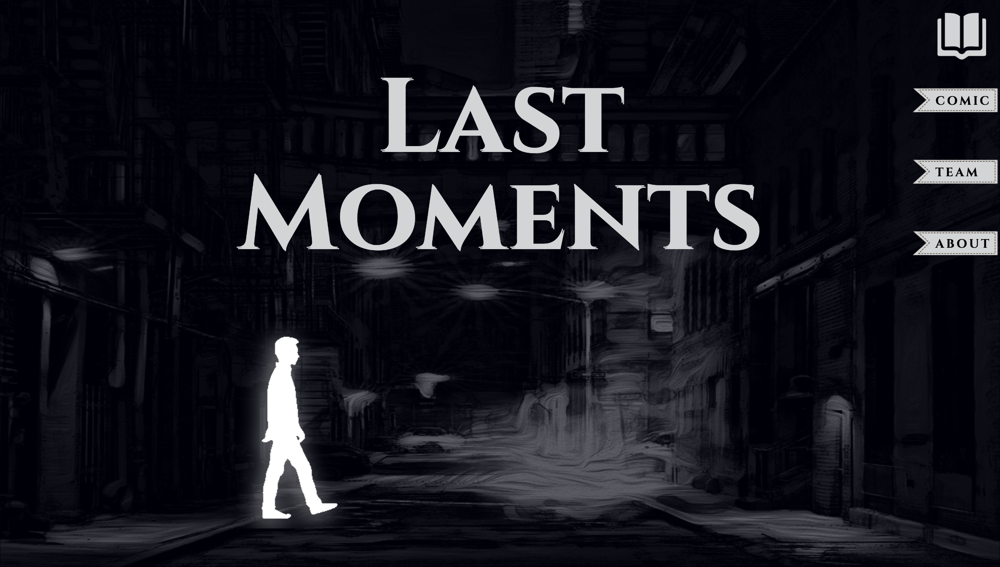
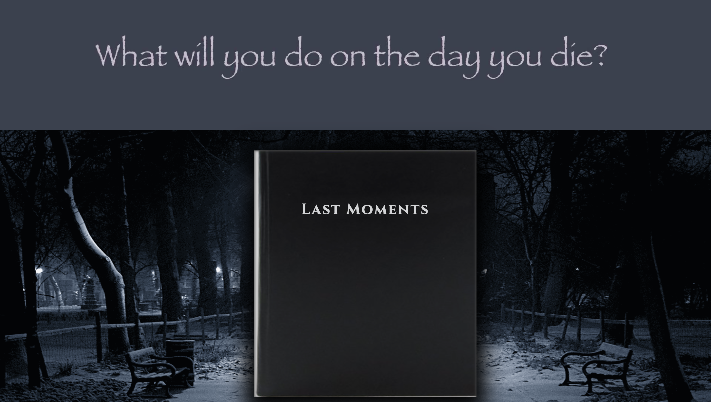
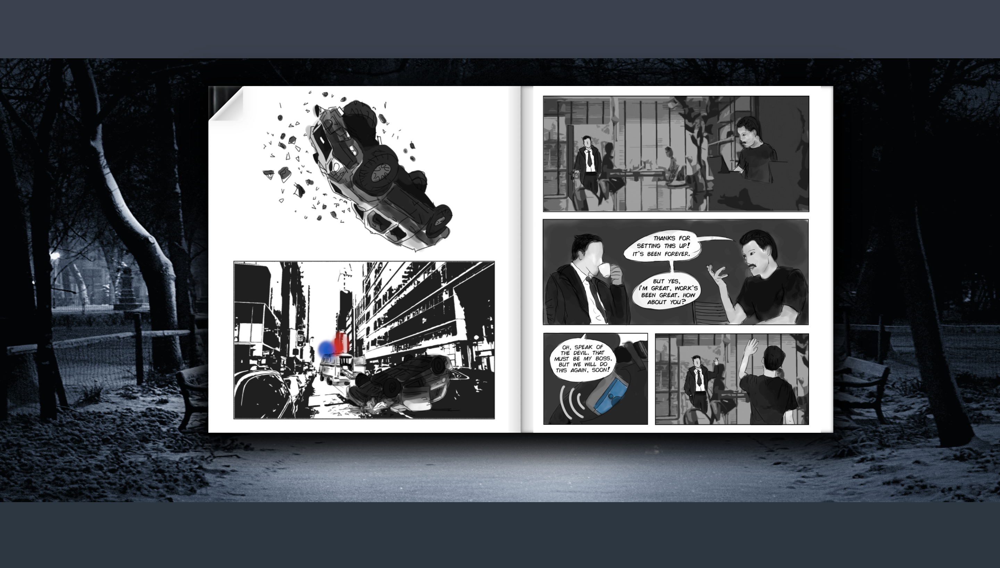
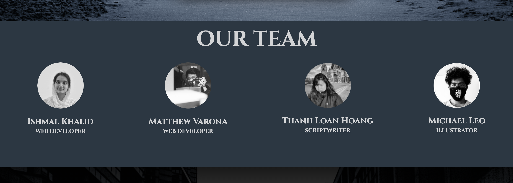
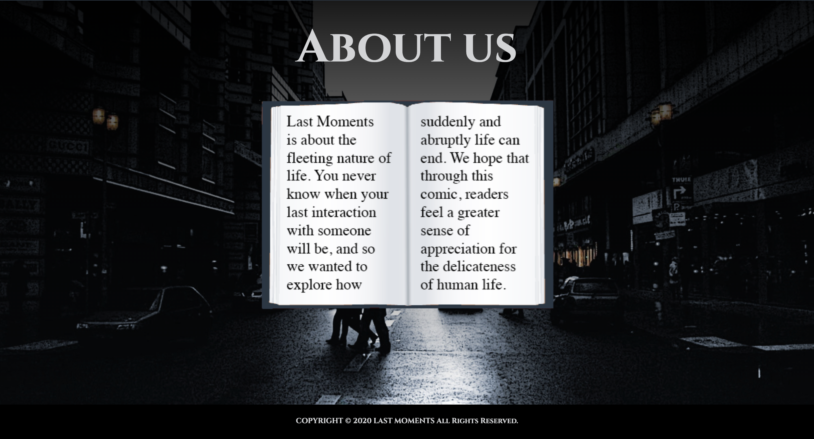

# Assignment 3: SOUNDS LIKE
## Website link: https://hasin-shabbir.github.io/soundProject/
## Concept: 
In the third assigment, me and my teammate - Hasin -  decided to create a sound experience on the website for the users. It is a journey to Pakistan and Vietnam through the countries' cultural music. 

We created a plot by having our conversation as two friends who are interested in learning more about each other's culture. The plot is the glue to attach two different countries and two different culture. 

The users of the website are first introduced to the context of the story with the conversation between to characters. After the conversation, the users will then be guided to the two countries. There, they will have the liberty to choose which music from which region of the country to experience. After choosing, the users will hear music and narration for that regional music. At the end of the journey, we concluded the story with an opening ending. The opening ending is implemented by giving the option to the users to suggest the destination that they want to have the same experience with in the future. The option is the suggesting box that the users can send opinions to the web developers. 

Our main focus on this assignment is the sound; therefore, we agreed in not using words or any description to explain. Instead, we use narration and everything was kept minimal so that the user will not be distracted with the visual. 

## Responsiblity:
In this project, I am the person who is mostly responsible for creating the plot, editing the sound using Audacity, and visually designed the website. 

## Difficulties:
For me, there were not much difficulties on this project as me and my teammate get along well. 
In term of web development, my teammate is very proficient so we basically has no problems in this. However, due to the fact that I did not contribute much in the code parts, I feel like I did not improve my coding skills as much as I wanted. Although the workload for this assignment for me is lighter than the previous ones, I do not enjoy the process and the result as much. After this, I think that I would push myself to envolve more into the coding parts to learn what I aimed when signing up for the course. 

## Improvements:
Personally, I think that there are a lot of spaces for further developmemt in the website, but mostly with the visual parts. After the class presentation, I think that our team might focused to much on the sound aspect and not as much in the visual of the website. I think there could have been more animation on our website so that it can be more lively. At the moment, I think compared to others', our website feel a bit too flat. 

## Some Footages of the Process:
### Idea Stages:
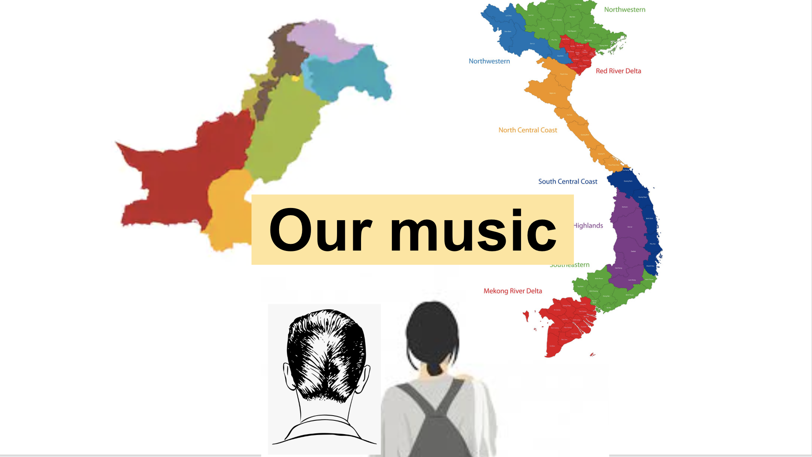
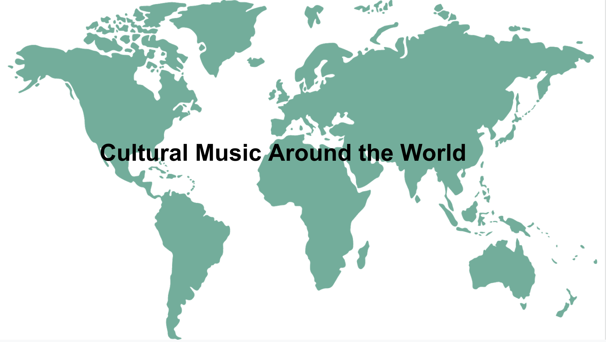

### Finished:
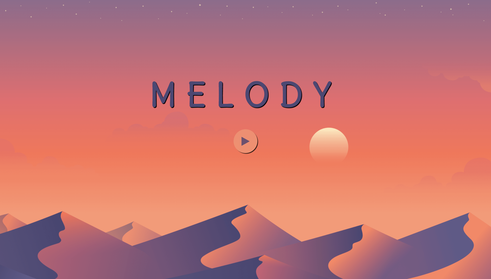
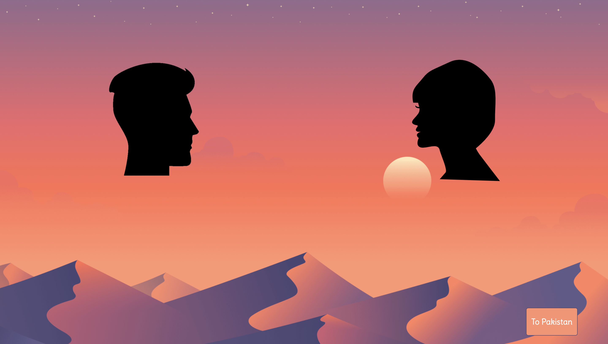
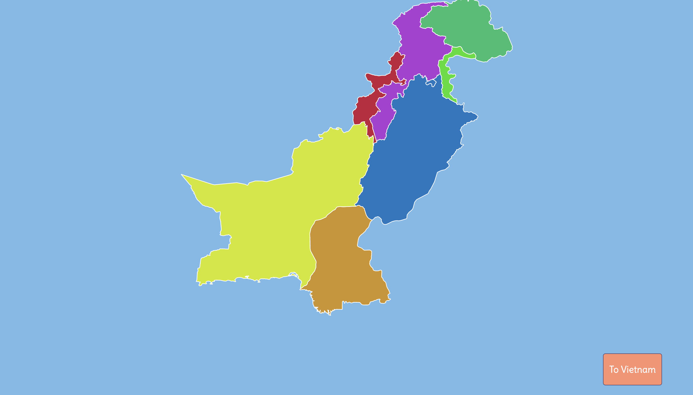

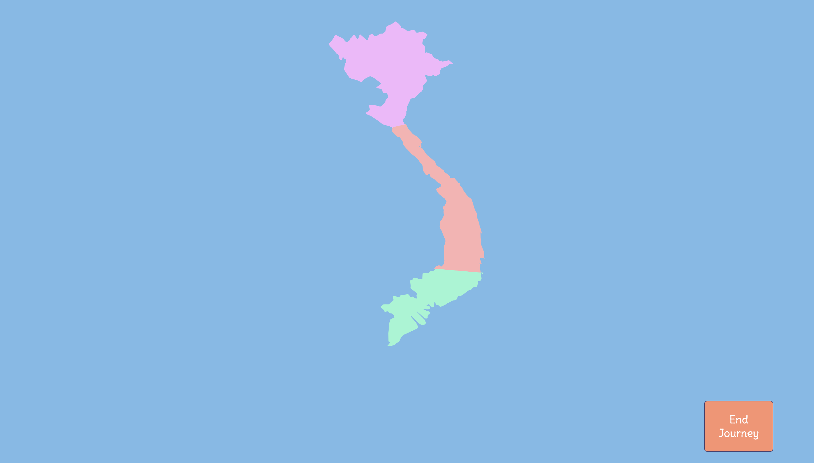

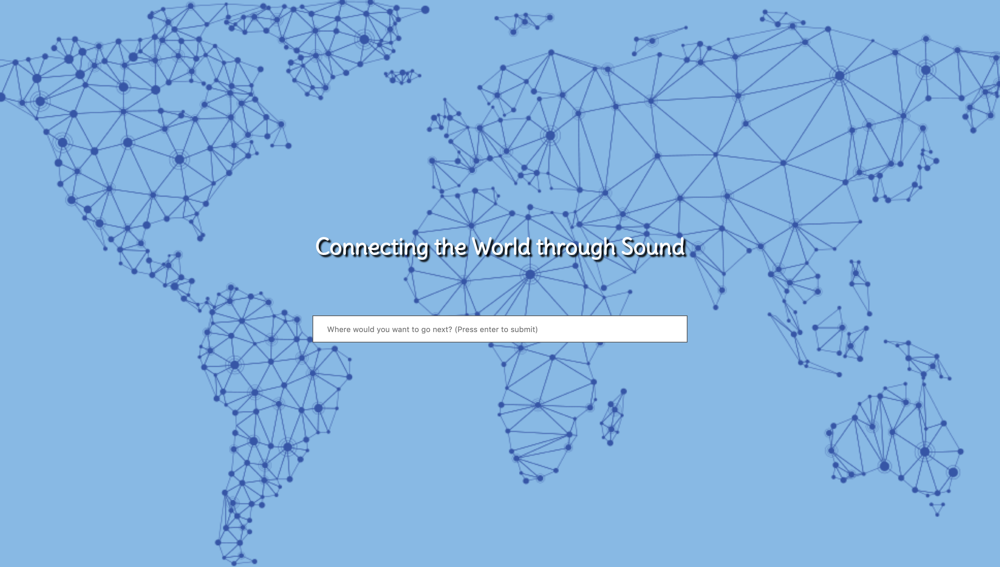

# Assignment 4: VID-E-OH!!!
## Website link: 
## Concept: 

In this assignment, my team (Loan - Fatima - Shamma - Rashid) decided to create a website, a company, and an advertisement video to promote our "product": THE BOX.

Although the requirment of this assignment is creating a website and a video, our team made a further step in order to create the most realistic scenario as possible by prototyping the box, having photoshoots for the box, et cetera.  

"THE BOX" is introduced as a more friendly "Alexa" intergrated with the newest AI technology. Other than normal task that a virtual assistant can do, this product is a friend that can give the users advices, comforts, and responsive feedbacks about feelings. All of these characteristics were portrayed to the customers through our video. 

Our product can speak 3 languages: English, Arabic, and French. We did not catergorize THE BOX's gender but instead, we just named two version of of THE BOX: Levon and Eiry. In term of THE BOX's voice, we ask two of our friends (Michael and Budoor) to do the voice over in the video and the voice previews on the website. 

## Video Making Process: 
### Plot: 
As mentioned earlier, the video is the opportunity for us to introduce THE BOX's features. The features are described through stories of the users. The stories are written by each of the member of the team. We also introduce different colors and voices of THE BOX in our video. 

The video starting with the CEO of the company (Loan) briefly welcoming the potential customers.
Following, the first story is about a student (Shamma) having burnout and stress while doing her assignemnt. She then complains with THE BOX and THE BOX gives out advices for her to overcome her negative feelings. Here, we want to portray that the box is capable of giving responsive advice about feelings and how to feel better. 

The second story is about a girl (Fatima) who works away from home and is having uncertainty about her family's feelings towards her. She is afraid that her mom would forget about her as she is not present at home. The girl is expecting to hear from her mom after not getting her message for a while. THE BOX here plays as a friend who try to console the girl with practical reasons why her mom is not responding and telling the girl not to overthink. 

Lastly, the third story introduce a guy (Rashid) who forgot about his pratice day while doing homework. THE BOX in the story helps the person with remidning the guys' schedule and to-do list. Here in the third story, we introduce the male voice of THE BOX. 

## Responsiblity:
In this project, I am the member who is responsible for producing the media: finalizing the scripts, filming, editing, recording for voice over and voice preview, and taking photos of the box. 

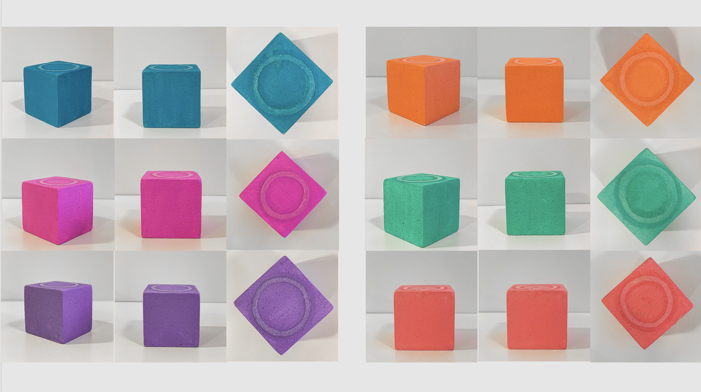

We used an IphoneXS for filming, voice record, and photos taking; Davinci Resolve for editing; Lightroom for color grading; and Photoshop for touching up the box.

For THE BOX's voices, we edited them so that they do not sound like they come from the same space as the charaters' voices are in. We wanted our boxes' voices to be human-like and friendly as possible while maintain the not-human aspect of them. Therefore, the voices were recorded with real human voice and edited using the Equalizer in Davinci Resolve instead of using voice generator online. 

Due to the fact that we filmed with a phone, the sound quality was not the best. Therefore, we decided to have dub for the video. Although the process of recording as syncing the voices to the image was hard, I am very happy with the result and the decision. 

## Difficulties:
In term of filming and media, there were not many significant problems that we encountered (I broke my phone gymbal after filming for Rashid's haha). 

For the web development, we encountered a decent amount of difficulties due to the fact that we have a lot of media needed to be on the websites. We were ambitious about the interactivity of the website. Unfortunately, I was not the person who involved in the coding part so I did not know in specifically what was causing the problems. 

## Improvements:
Overall, I do think that this is a very nice project. However, there are still rooms for futher improvement. I think that if possible, we will design the layout of the website better. For example, we can touch up the logo of the company so that it become cleaner and more professional. Also, the font in the website can be more persistent. The color scheme of the website can also be adjust to make the product standout more as at the moment, there are too much color on the website. We can make the review section more realistic by using better photos. Last thing, we can spend more time in figuring out the slideshow for the photos with out breaking down the site.

In conculsion, I think the website does deliver what our team inteded to introduce to the customer: colorful and friendly. I think that the website does offer a good user experience. 

## Some Footages of the Process:
### Wireframes:
